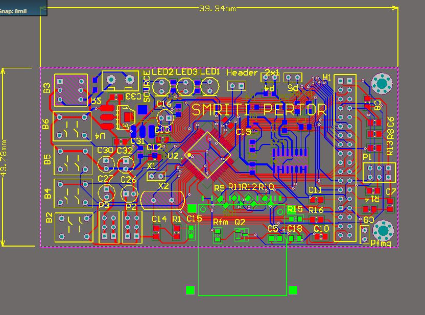

# Undergraduate_project
These project have done during my undergraduate study.  It's only take record for my interesting zone.

# 本项目属于杂乱的项目仓库收集区

* 包括本科期间大一大二大三的所做的项目，本科期间所获得的奖项等类容，未特别申明项目，整个项目均为个人参与，不存在他人贡献，版权归作者自己，不存在抄袭哈。
* 可能会问大三大四项目那么少，因为大四实习，都是公司机密，不透露了，哈哈
* 申明一下，当年在学校我的软件比硬件墙，不要我没贴代码就说我是搞硬件的，虽然当时软硬都来，但是软件还是强点，哈哈。现在我在做什么，就不告诉了
-------

# 项目列表 

## 项目一 基于磁耦合谐振的无线输电项目

该项目为我本科期间参加的天上春前杯，大学生物理电子设计大赛获奖作品

由于照片拍摄于本科期间，当时手机像素有点不好，可能不是严谨的展示，包括平时也比较忙，所以也就没进行PS修正，由于代码量太大，所有项目均不附上代码展示，如需代码自行去本仓库找寻，均有上传。

本项目的更多效果图如下：

[资料地址](./无线输电项目),具体请查看本仓库目录。

[硬件仓库入口](./无线输电项目/硬件电路/)

## 项目二 激光传声项目

该项目主持者为我的室友周周和我

项目的具体 文档建[仓库地址](./激光传声项目)

项目的[硬件设计电路地址](./墙体水管检测项目/项目帮给学姐做毕业设计了/卞苗苗论文/miaomiao/PVC管检测/)

[软件代码地址](./墙体水管检测项目/项目帮给学姐做毕业设计了/卞苗苗论文/miaomiao/资料)

## 项目三、蓝桥杯2015年嵌入式板子程序和电路

程序流程图:

## 项目四、超声波项目

该项目也是帮学长做的毕业设计，实现的功能如下：

* 四通道 ，前后左右，超声波测距
* 测量距离从5mm-5m距离之间，误差不超过5m
* PCB和程序代码均为个人设计

超声波的主机PCB图：

超声波的从机PCB图：

## 项目五、机器人的舵机控制板设计项目

* 该项目主要是编写BOOTLOADER代码实现
* AVR控制板和上位机的串口更新代码
* 控制板支持体操等竞步机器人的在线动作调试
* 支持串口更新代码
* 支持无线的机器人动作调试

具体的代码实现请移步我的[代码仓库](avr舵机控制)自行查找，因为年过久远，也不想细细整理了

## 项目六、矿下受力监测项目

主要实现功能：

* 实现钢架应力的精确采集
* 精确测出钢架梁的受力大小，如果受力过大 就进行报警
* 数据通过以太网上传至服务其中 
* 数据存储方拾贰，存到硬件设备的内存卡中
* 报警功能

硬件照片：

第一个版本PCB：

第二个版本PCB：

[硬件地址](./项目一刘师的矿下检测设备2015-6-20/刘师PCB工程/)

项目七、数字仪表都市自动识别系统

系统的功能如下图：

数字图像采集来自测量仪表，通过对仪表的视频流周期取图像帧，运用图像识别算法实现实时的数字仪表读数的识别。

并且项目也申请软著等

效果视屏地址见youku：

[基于IP网络摄像头的数字仪表图像识别](http://player.youku.com/embed/XMTYxMTE0NTQ0OA==)

[数字仪表识别系统](http://player.youku.com/embed/XMTYwNDM1MjQ0MA==)

[更多视屏欢迎订阅我的youku前去查看](http://id.tudou.com/pertor?spm=a2hzp.8244740.0.0)

当然还有好多的项目，因为这些都是2015年前搞得项目，现在 2019来整理，太多的真的就找不到了，这些都是从我当年 云盘中找的，好多都并没有备份，没了就没了吧

其他项目以后找回来了再写，目前撰写时间2019年1月

* 总结下，当年大一大二的东西，电路画的现在看看确实很烂，看着还很恶心，哈哈哈，但是谁没有过入门的时候呢
* 关于代码，真的是代码太多了 ，我其实偏向的是码代码，搞硬件真的是业余，当然看仓库中的代码写的格式真的想骂人，所有 项目我目前不可能改，或整理，因为我要花时间在别的上面，所以，代码能看就看吧，不能看用也行，还是那句谁没有过入门的时候呢。

哈哈，让看代码的人去骂吧，反正，我看着我曾经的代码 ，感觉就是 乱七八糟 ，以后养成好习惯还是好的

未完。。。。。。。。。。。。。。

